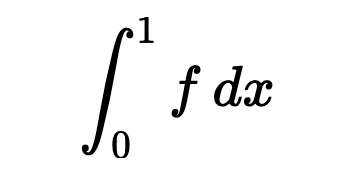
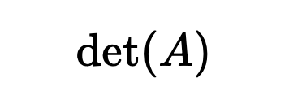
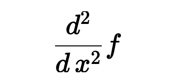
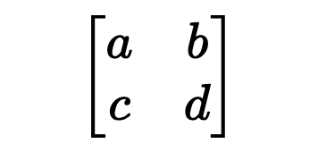
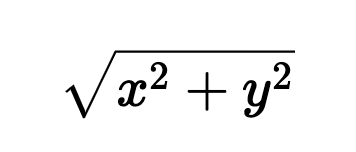

# Python Expression Visualizer

Instantly render Python math expressions as beautifully formatted equations. Supports NumPy, SymPy, SciPy, and standard Python math — works in `.py` files and Jupyter notebooks.

## Usage

1. **Select** any Python math expression or line
2. Press **`Shift+Alt+V`** or **`Shift+option+V`** to open the equation preview
3. Click **"Open Extended Viewer"** for a larger view with Raw / Evaluated toggle

## Examples

| Python                        | Rendered                                       |
| ----------------------------- | ---------------------------------------------- |
| `sp.integrate(f, (x, 0, 1))`  |     |
| `np.linalg.det(A)`            |  |
| `sp.diff(f, x, 2)`            |         |
| `sp.Matrix([[a, b], [c, d]])` |       |
| `np.sqrt(x**2 + y**2)`        |    |

## Features

- **Library-agnostic** — `np.trapz`, `sp.integrate`, and `scipy.integrate.quad` all render as ∫
- **SymPy evaluation** — when SymPy is installed, shows both the raw equation and the evaluated/simplified result
- **Wide coverage** — trig, hyperbolic, inverse trig, integrals, derivatives, limits, sums, products, matrices, special functions (Γ, erf, Bessel, etc.), Fourier transforms, and more
- **Greek letters & subscripts** — `theta`, `omega2`, `x_i` all render correctly
- **Works in Jupyter notebooks**

## Keybinding

| Action        | Windows / Linux | Mac              |
| ------------- | --------------- | ---------------- |
| Quick preview | `Shift+Alt+V`   | `Shift+Option+V` |

You can also right-click a selection and choose **"Visualize Expression"** from the context menu.

## Requirements

- **Python + SymPy** (optional) — if installed, enables the "Evaluated" view showing simplified results
- No other dependencies required — the extension works offline out of the box
